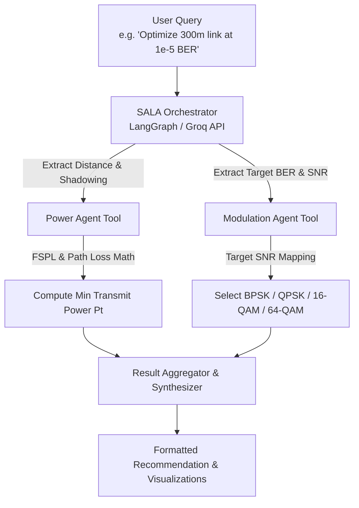

# SALA: Smart Adaptive Link Agent 📡🤖

**SALA** (**S**mart **A**daptive **L**ink **A**gent) is a multi-agent AI framework designed to dynamically optimize wireless link parameters—specifically **transmit power** and **modulation schemes** (BPSK, QPSK, 16-QAM, 64-QAM)—in fluctuating radio environments.

---

## 🌟 Problem & Overview
In dynamic wireless communication systems, channel conditions constantly degrade due to path loss, log-normal shadowing, and background noise. Traditional non-adaptive schemes rely on fixed transmit power or static modulation, causing either high energy wastage or sudden link outages[cite: 1].

While Large Language Models (LLMs) excel at interpreting complex human queries, they suffer from mathematical hallucinations when solving physical-layer channel formulas. **SALA** bridges this gap by utilizing LLMs purely as orchestrators and routers, delegating all exact mathematical calculations to deterministic Python tools

---

## 🎯 Key Capabilities
* **Agentic Task Routing:** Parses natural language operational requirements and routes parameters using LangChain/LangGraph and Groq API
* **Deterministic Power Optimization:** Computes Free-Space Path Loss (FSPL) and log-normal shadowing to recommend the minimal required transmit power ($P_t$)
* **Adaptive Modulation Engine:** Maps SNR constraints to optimal digital modulation schemes (BPSK, QPSK, 16-QAM, 64-QAM) to maintain target Bit Error Rates (BER)
* **Baseline Benchmarking:** Evaluates performance against fixed-power and fixed-modulation baselines across simulated link distances ($10\text{m} \rightarrow 1000\text{m}$)

---

## 🏗️ System Architecture & Workflow

### High-Level Flowchart


## 📁 Repository Structure

```text
sala-agent/
├── data/                       # CSV logs & saved output charts
├── docs/                       # Project documentation
├── src/
│   ├── agents/                 # LangGraph orchestrator & system prompts
│   │   ├── router.py
│   │   └── prompts.py
│   ├── tools/                  # Deterministic physical layer tools
│   │   ├── power_tool.py       # FSPL & log-normal shadowing math
│   │   └── modulation_tool.py  # BER to SNR & scheme mapping
│   ├── baselines/              # Benchmark schemes
│   │   ├── fixed_power.py
│   │   └── fixed_modulation.py
│   └── utils/                  # Plotting & helper utilities
│       └── plotting.py
├── main.py                     # CLI Entry point
├── requirements.txt
├── .env.example
├── .gitignore
└── README.md
```
